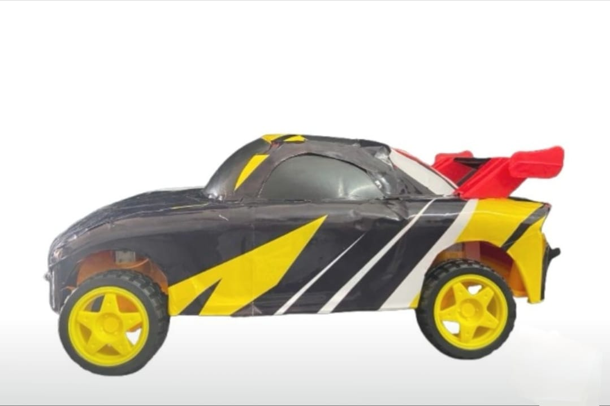

# Voice-Controlled-Car

Voice-Controlled Car Using Arduino Uno is an embedded systems project that enables wireless vehicle control through voice commands. A smartphone application recognizes the user's speech and sends commands via the HC-05 Bluetooth module to the Arduino Uno, which processes the commands and controls the DC motors through the L293D motor driver shield.


## Features

- Voice-controlled navigation
- Bluetooth communication
- Wireless operation
- Real-time motor control

## Components

- Arduino Uno
- HC-05
- L293D Motor Shield
- 4 DC Motors
- Chassis
- Battery Pack

## Circuit Diagram

## Working

The Voice-Controlled Car operates by receiving voice commands from a smartphone through Bluetooth communication. A voice control application installed on the smartphone converts spoken commands into text and transmits them wirelessly to the HC-05 Bluetooth module. The HC-05 forwards the received commands to the Arduino Uno through serial communication.

The Arduino Uno continuously monitors the incoming Bluetooth data and compares each command with predefined instructions. Based on the received command, the Arduino controls the L293D motor driver shield, which drives the four DC motors to perform the required movement.

The system responds to the following commands:

| Voice Command | Action |
|--------------|--------|
| **Forward** | Moves the car forward |
| **Backward** | Moves the car backward |
| **Left** | Turns the car left |
| **Right** | Turns the car right |
| **Stop** | Stops all motors |

### Working Flow

```
User Speaks a Command
          │
          ▼
Smartphone Voice Control App
          │
          ▼
Speech Converted to Text
          │
          ▼
Bluetooth Transmission (HC-05)
          │
          ▼
Arduino Uno Receives Command
          │
          ▼
Command Processing
          │
          ▼
L293D Motor Driver Shield
          │
          ▼
DC Motors
          │
          ▼
Robot Car Movement
```

Working demo


## Project Images



## License
MIT
